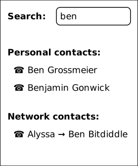
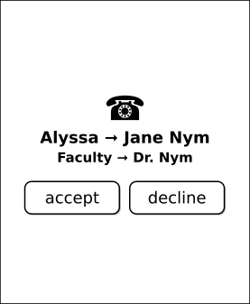

# Making DIDs Invisible: Petnames and their Secure User Interfaces

By Christopher Lemmer Webber, Mark S. Miller, Zachary Larson, Kate Sills,
and Eli Yaacoby

> "If we ever show a DID to a user we have failed."
  
Names must be human-readable in order to be widely used. 
Unfortunately, while DIDs and Tor .onion addresses are 
decentralized and globally unique, they are not human readable. How can
we build user interfaces that real users might actually use?  In this 
paper we provide an overview of petname systems, a way of mapping
human readable names to cryptographically secure names, and describe
changes to two user interface designs that we believe that are
compatible with intuitive user expectations.  We first discuss the
smartphone contact list as already approximating petnames to some
degree and discuss how to augment it with secure introduction.  We
then walk through several changes to browsers (which may be provided
natively or as an extension) which add the functionality of a petname
system.  By utilizing petname systems we are able to collectively
support individual naming definitions, community curated directories
of names, as well as exiting naming authorities such as certificate
authorities and the domain name system, government agencies such as
trademark offices, and decentralized systems such as Namecoin.

# The what and why of petname systems

> "What's the use of their having names," the Gnat said, "if they won't
> answer to them?"
>
> "No use to them," said Alice; "but it's useful to the people that name
> them, I suppose. If not, why do things have names at all?"
>
> &#x2013; Through the Looking-Glass, and What Alice Found There

[Zooko's Triangle](https://en.wikipedia.org/wiki/Zooko%27s_triangle)
tells us that names can have two out of three properties:
decentralized, globally unique, human meaningful.
[DIDs](https://w3c-ccg.github.io/did-spec/) and tor .onion addresses are decentralized and
globally unique; they are intentionally not built to be human
readable, and yet are meant to be used by humans.
Consider the following example DID:

    did:example:fbc0f54d1a084b469490ff78d55632ea

Identifiers like this look like gobbledygook to you and me, so how can
we use them?

[Petnames](http://www.skyhunter.com/marcs/petnames/IntroPetNames.html)
offer a way forward by mapping local names to global identifiers and
vice versa.
By adding a petname system as an additional layer to a globally unique
and decentralized system, we are able to achieve all three properties.

A "petname system" is a database and a set of interfaces which use that
database to bidirectionally map human readable names to
cryptographically secure names.
The three types of names in a petname system are:

- **petnames**: These are set locally by a user to map local meaning
  to an external identifier.
  For example, "Mom", "Uncle Bob", and "Pawnee Library".
- **edge names**: Every entity in a petname system may act as its own
  namespace, providing "paths" to names to other entities in the
  system as a graph, and these provided names are called "edge names".
  For example, "example.org" is an edge name in "dns ⇒ example.org",
  and "Sarah Smith" is an edge name in "Uncle Bob ⇒ Sarah Smith".
  We don't have to get rid of popular naming systems like DNS, but can
  absorb them in such a way that they are on equal footing with any other
  entity.
- **proposed names**: These are names which are introduced within a
  local context.
  For example, email permits users to specify a name on its addressing
  along with the email address.
  If you get an email that is cc'ed to `Ben Bitdiddle <ben@example.org>`,
  "Ben Bitdiddle" would be the proposed name.
   - **self-proposed names**
     In some applications, such as in social network software, it is
     possible to retrieve an entity's profile to see how that entity
     would like itself to be referred to.  We call this a self-proposed
     name.

# Implementing petnames

## Smartphone contact list integration

One system that is already very similar to a petnames system is a
smartphone's contact list application.
Contact list applications use phone numbers as a global namespace
without making phone numbers the primary user experience.
Human meaningful names are mapped to phone numbers with no pretense
that the names have global experience; the names are chosen by each
human operator according to what is useful to them.
The UI uses this mapping both to search and select entities from a
contact list to display a name in an incoming call, or to review call
history.
The rendering it done in terms of a live mapping; should an entity's
petname be updated, that petname will be retroactively updated on the
call history.

So a smartphone contact list brings us reasonably far, but not quite
far enough.
Let's consider a scenario in which we can explore the rest of the
pieces to complete this puzzle.

Alyssa receives a phone call from 1-324-555-8953.
However, when she checks her phone to answer it, she does not see
the phone number itself, she sees "Mom", which is the petname she has
bound locally to the phone number.

<!-- TODO: Insert incoming phone call image here -->

Alyssa answers the call and her mother, Dr. Nym, mentions that she's
giving a special lecture on mathematics that she would like help
organizing, and wonders if any of Alyssa's friends may be interested
in attending or assisting.
Alyssa offers to help and suggests that her long-time friend Ben
Bitdiddle may be interested in both attending and helping.

Dr. Nym says goodbye to her daughter and hangs up the phone.
She searches for "Ben" in her contact list:

The "personal contacts" section shows **petnames** of people she knows,
and "Ben Shapiro" is a research colleague of Dr. Nym's.
The "network contacts" shows **edge names** published by entities
Dr. Nym has stored locally as
petnames.
Dr. Nym has stored her daughter as "Alyssa", and so when she sees
"Alyssa ⇒ Ben Bitdiddle" ("Ben Bitdiddle" being the edge name supplied
by Alyssa) she is confident this must be her daughter's friend.
She clicks this entry and dials Ben.

Ben hears an incoming call and sees that the caller is labeled
"Alyssa ⇒ Jane Nym" and in smaller text "Faculty ⇒ Dr. Nym".

While Ben did not have Dr. Nym saved with a local petname, he
has both Alyssa and the university's Faculty directory saved as local
petnames, and from the both of those remembers that Alyssa's mother
is named Jane Nym and that she is a professor on campus.
Ben accepts the call and enthusiastically agrees to help Dr. Nym
set up the event.
Ben offers to coordinate food for the event, and Dr. Nym
enthusiastically states that while she will place an order for pizza,
she would not have time to pick it up beforehand, and so help there
would be greatly appreciated.

Ben decides that since he is helping out that he should store
Dr. Nym's contact information permanently in his address book.
Ben checks the call history and sees that the first item says
a call from "Alyssa ⇒ Jane Nym".
He selects "Save Contact" from a menu.

On the edit screen that appears, a "local name" widget is immediately
selected with a suggested entry of "Jane Nym" highlighted in such
a way that if Ben were to begin typing he could override this text.

<!-- TODO: Menu with select local name -->

Ben decides this name is good enough; since he knows Alyssa's mother
on a personal basis through Alyssa, he is comfortable thinking about
her as Jane Nym.
Ben decides that he would also like to share this contact as an edge
name with the rest of his contacts, and so presses the "share with
contacts" button.
Once again Ben is presented with an editable field with the name
"Jane Nym" preselected, but Ben decides to edit this edge name to
be called "Dr. Nym".

<!-- TODO: Menu with dr nym -->

While Ben knows Dr. Nym on a first name basis in a personal context,
Ben and Dr. Nym both work in an academic setting, and in such contexts
he thinks it would be respectful for others to hear Dr. Nym referred
to with her full title.
Dr. Nym's phone number is already entered, and with the mapping
established, Ben presses save.
Returning to the recent calls page, he sees that the contact list's
display has been updated to saying simply "Jane Nym" for the most
recent call.

Meanwhile Dr. Nym is wasting no time in placing the order for the
pizzas for the event.
She finds on her desk an advertisement for "Pizza Piano", a local
pizza chain, which includes a QR code that she can scan.
The QR code only supplied the number to be called for the local
restaurant, but Dr. Nym's phone supplies the identifier
"bizdir ⇒ Pizza Piano East".
"bizdir" is a business directory naming hub that Dr. Nym uses which
independently verifies that local businesses are who they say they
are.
Dr. Nym is satisfied enough by this to be confident calling the
establishment and paying for pizzas.
She calls, pays, and tells the cashier who is taking the order that
Ben will be the one picking up the pizzas and handling any additional
details and supplies them with Ben's number.

Time passes, and just hours before the event Ben gets an incoming
phone call from a number he has not saved as a petname and for which
none of his contacts have provided a petname (including that Ben does
not have the same business directory Dr. Nym does as a contact
either).
"Caller ID" does provide an **proposed name** of "Pizza Piano" for this
context (though there is no guarantee that "caller ID" provides the
same proposed name to others for this phone number), however since this
is a contextual name and Ben's contact and phone applications do not
want Ben to be confused, this renders as "Pizza Piano.2".

<!-- TODO: proposed name example -->

"Pizza Piano" is the proposed name, but Ben has already had contact with
one of the other Pizza Piano franchise locations, and so the system
distinctively marks this one as entry 2.
Ben's petname system will automatically increment this number until it
exceeds 9, at which case any new encounters with a proposed name of
"Pizza Piano" will simply render as "Pizza Piano..."

Ben answers the call; the pizza parlor employee merely wanted to let
Ben know that they were all out of olives and wanted to know if another
ingredient would be acceptable.
Even though Ben is trusting that caller ID is correct, he can't
imagine any reason why someone would be trying to phish him to
authorize a topping change, so he suggests changing from olives to
mushrooms.
Now all that's left for Ben to do is pick up the pizzas!

## Web browser integration

While smartphone contact lists already have much in common with
petname systems, web browsers require more care. But if we pay attention to what the boundaries and usage behavior
of modern browsers are, a petnames system can be built which matches
user expectations.

As Eric Lawrence [explains](https://textslashplain.com/2017/01/14/the-line-of-death/), 
in web browsers, the browser itself typically has control over the top of the window. 
However, below the address bar, the webpage can display whatever it wants, causing
Lawrence to call this demarcation the "Line of Death."

Even the supposedly safe area, above the Line of Death, is in danger -- 
HTML5's Fullscreen API, for example, allows the webpage to control the 
entire screen area. Moreover, mobile web browsers have dispensed with 
the idea of a trusted header entirely. 

However, web browers do get some things right. For instance, they proposed 
the idea that the address bar *should be* a trusted path. 
Furthermore, a web page, when visited over a secure connection,
is able to present a link that does express where the web page
would like you to go. And usefully browsers already provide something that 
is very much like petnames: bookmarks, which allow users to map a locally human
meaningful name to a global identifier.

Unfortunately browsers also have different design decisions which can
make providing a secure environment difficult.
While it is good that the web page can direct the user successfully to
another page of the original page's choosing, it is possible to "bait
and switch" users into believing they are going to one web page when
in fact they are being sent to another.
For example, on desktop browsers if a user hovers over a link the bottom
bar of a browser can indicate to a user where they will probably go.
Unfortunately this is not guaranteed to be the actual place the user
will be sent; for example, a web page can intercept the click in
javascript and direct the user somewhere else.

To see how petnames (if correctly implemented) can help, we will
analyze a specific scenario, in which a website (paypa1.com) attempts to pass
itself off as paypal.com, hoping to capitalize on the similarity of appearance 
in the names.

Previous implementations of petnames in the browser have used a separate bar 
adjacent to the address bar to display the petname, such as in
[Tyler Close's 2005 paper](https://www.w3.org/2005/Security/usability-ws/papers/02-hp-petname/). 
Our implementation shows the petname itself in the address bar. If the user has a 
 local petname (essentially, a bookmark name), the local petname is shown. If the user 
 does not have a local petname, an edge name is shown, using the ⇒ symbol as in 
 the contact list example.
 
Alice hasn't used Paypal before, so she types "Paypal" into Google. She clicks on the top
result, and is taken to the webpage. At the top of her browser window, the address bar
shows "DomainSpace ⇒ paypal.com", indicating that paypal.com is a edge name that is provided
by the domain name registry DomainSpace. Alice prefers to use DomainSpace as her main petname
provider because DomainSpace has a strict policy of allocating all "nearby" names as a package
whenever a domain name is sold, so that scammers cannot claim a lookalike name later. 
For instance, "DomainSpace ⇒ paypa1.com" automatically redirects to 
"DomainSpace ⇒ paypal.com" because paypa1 was close enough to paypal it was sold
as part of the same package. (For more information on  "nearby" names (also called "confusables") 
see [Unicode Utilities: Confusables](https://unicode.org/cldr/utility/confusables.jsp).
 

<!--

 - when can you and can't you control the "body" of the interface?
   yes on a mobile application but not on 

 - assumptions: we're assuming that you don't have a soci
 - the top bar shows the name from the petname system

 - footnote: why we didn't do the bottom bar and the hover (you
   can't take control from the web page about where you will go)

 - You must copy around the URL and *NOT* the petname.
 - footnote: bookmark should by default add a petname for the whole url but may
   expose an option to give a petname to the whole prefix
-->

# Conclusion

# Glossary

-   **naming hub:**

# Extended reading

<h2 class="footnotes">Footnotes: </h2>

<a id="fn.1" name="fn.1" class="footnum" href="#fnr.1">1</a> The pattern of using a path separator for edge
names comes from [SPKI/SDSI](https://en.wikipedia.org/wiki/Simple_public-key_infrastructure).
We considered using various separators including forward slashes, the
english possessive "'s", and various others, but settled on a unicode
arrow to give the impression that path separators are implementation
specific and that delimiters may not even be typed in by hand.

<a id="fn.2" name="fn.2" class="footnum" href="#fnr.2">2</a> Phone numbers are one example of
not-particularly-human-memorable identifiers, and since contact list
applications so frequently deal with them, we've stuck with that example.
Of course there's no reason a contact list couldn't deal with DIDs or
other URIs or tor .onion addresses or really any such global
identifiers.

<a id="fn.3" name="fn.3" class="footnum" href="#fnr.3">3</a> It is important to deliver a reasonable
sorting order to the names presented.
In general, petnames should always be presented first.
Following petnames should be one-level-deep edge names.
What entities should be prioritized to provide edge names?
This might depend on the user or application, but it would be reasonable
that trust might vary here, with well known naming hubs and trusted
(which may mean frequently interacted with) other entities.

<a id="fn.4" name="fn.4" class="footnum" href="#fnr.4">4</a> One detail we've glossed over is how edge
names are shared in the first place.
There are many routes to providing edge names, from occasionally
sharing a certificate with an entire list of edge names with all
followers to querying an endpoint from a particular entity on demand.
Implementations of petname systems may vary in their implementation here.

<a id="fn.5" name="fn.5" class="footnum" href="#fnr.5">5</a> Of course a contacts system may have a composite of
values for a particular entity, such as email alongside a phone number
(or numbers).
This is possible in a petnames system, as long as such mappings remain
bidirectional, but we have left out such details from our example scenario
to keep it simple.

<a id="fn.6" name="fn.6" class="footnum" href="#fnr.6">6</a> Note that we did not suggest that Dr. Nym typed in
the phone number.
Typing in identifiers is problematic enough with phone numbers, and far
more dangerous with larger cryptographically secure names.
See also the first line of this paper.

<a id="fn.7" name="fn.7" class="footnum" href="#fnr.7">7</a> 
DEFINITION NOT FOUND.

