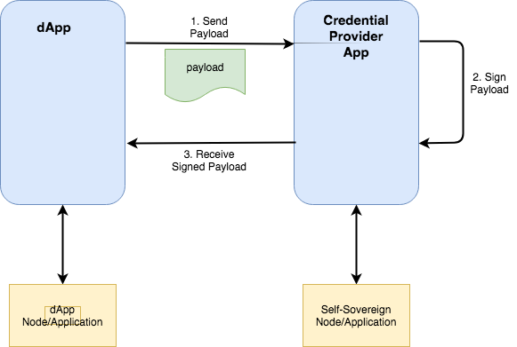

# Credential Providers for Signing Application Requests #

Authored By: Cedric Franz

## Introduction ##
For an applications interacting with a Credential Providers there is a need sign requests in much the same way that you 
would sign a transaction with MetaMask to execute a function call on a Ethereum smart contract.  For a more generic signing 
capability, the data would need to be passed to the Credential Provider in some sort of 'payload' for signing and then a 
signed payload should be returned. This simplistic view is relatively simple to achieve.  There are however a number of other 
considerations that also need to be addressed in order to improve the capabilities and the user experience.

## Proposed Design ##

1. The DApp builds a payload in JSON form
2. The User selects a Credential Provider that they have setup on their device
3. The payload is sent to the Credential Provider
4. The Credential Provider opens and the payload is displayed to the user. The Credential Provider requests the user to 
sign the payload
5. The signed payload is returned to the DApp
6. The DApp processes the signed payload where the signature can be verified

## Considerations ##
### Communication Between Application and the Credential Provider
A standard way needs to be decided in order for the dApp to find the Credential Provider and open a communication channel in 
order to facilitate the signing process. 

*Proposal:*

A standard API should be constructed and all credential providers implementors would need to build to this API.  These
could include functions such as: creating a DID, retrieving a DID, signing a payload etc.

### Data Augmentation ###

Often the payload data is constructed from data in the DApp and the Credential Provider.  For instance: If a package is being 
delivered the deliver agent would have an app that would construct a payload of information regarding the package, delivery 
status etc. The recipient would requested to sign for the delivery and during that process some additional information other 
than the recipient's DID might also need to be included, such as the recipient's name, which should be populated by the 
credential provider of the recipient.

*Proposal:*

Standard schema and field definitions shoul dbe used to identify certin pieces of data.  Use of schema's such as those from 
Schema.org should be strongly encouraged when formulating a payload that requres data augmentation by the Credential Provider.

### Data Rendering ###

When the user is presented with the payload contents, this needs to be displayed in a user friendly format.  I order to 
present the data to the user, addtional layout information should also be passed along with the payload that is understood 
by the credential provider app in order for the credential provider app to display the contents correctly formatted to the 
user. The layout information should not be signed only the payload.

*Proposal:*

Option 1: Define a standard for passing fomatting information through to the credential provider in order for the 
credential provider to display the payload in a user friendly way.

Option 2: Get the credential provider to display contents that are preformatted by the sending DApp. The risk here 
is that the credential provider will be unable to verify that the preformatted contents and the payload contents 
are the same data.  Hence the user might see one payload displayed, but sign a different payload.

Option 1 is preferred

## Conclusion ##
In order to greatly increase the utility of self-sovereign identities and the cryptographic signatures linked to them 
there need to be standards put in place to facilitate the interactions between applications and the credential providers. 
