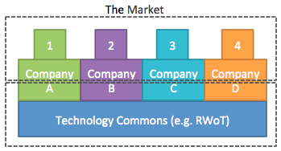

# Towards a Sustainable Technology Commons

#### Revisiting economic models that support decentralized R&D in a commons based environment using Appreciative Inquiry

### Heather Vescent (<puissant@heathervescent.com>, @heathervescent)

### Topic Paper for Rebooting Web of Trust

### Santa Barbara, March 2018

### Version 1.2

In today’s interconnected world, technology
is increasingly developed in common by competing businesses. This common
technology is at the foundation layer, with companies utilizing,
extending and customizing it as they develop their own product offerings
for the market. Many corporate products are built upon the “raw
material” of this kind of technology. These companies gain financial
benefit when they sell the product, but there are few ways for that
financial benefit to trickle down to the fundamental, technology commons
level, without which, that product would not be available.

There are few economic models that support the development of technology
commons, while addressing the capitalist use of that common technology.
Open source technology is one model. A top-down model is for-profit
companies join together to fund a non-profit to develop technology for
use by by partner companies (e.g. SWIFT). A bottom-up model emerges from
ad-hoc technology communities where bleeding edge and disruptive
technology is explored as it is developed, mainly by technologists. 
Governments pursue their own R&D investment strategy that in effect, 
invest in technology commons with the end goal of encouraging diverse 
marketplace. 

Rebooting Web of Trust (RWoT), along with other events, is one of these
bottom-up, ad-hoc technology commons. Participants build relationships
with each other as they work together on projects. Results include
whitepapers, development of technical specifications, and working code
as proof of concepts. The results are part of the technology commons of
RWoT and they are valuable, usable, and actively influence technology
specifications, product development, and vision.

The community has developed some typical problems that arise in commons,
so why not use the common space to explore these problems we’ve created?
This topic paper asks the community:

-   How can capitalist activities using common technology support the
    technology commons?

-   Can technology inherently enable an economic model that supports
    technology commons?
    
    -   What is the role of Government R&D in enabling and supporting 
    technology commons?

Without resolving these problems, we invoke the tragedy of the commons,
where the commons may collapse due to individuals gaining short-term
benefit, without supporting the commons itself. When common’s collapse
we lose a diversity of solutions, applications and mindshare, not to
mention a delayed negative impact to the companies and individuals who
no longer have the commons as a resource.

**Problem: The Free Rider**

It doesn’t feel good when a company comes to a technology commons,
learns about ideas and technology and then to implement it for their own
corporate benefit without returning anything to the technology
commons. This is the biggest problem with commons – the free rider.

There should be a contribution to the commons from successful
applications of technology/ideas that comes from the commons. This
ensures a thriving technology commons that is not exploited to
extinction by the most powerful players.

While not directly addressed, free riders are easily identified in the
community. At RWoT, some companies have been identified as free riders
while others have not acknowledged the commons itself in their corporate
communications. At the last RWoT, I spoke to a number of people about
this topic and heard these comments:

-   It's unacceptable to participate and not give back.

-   If the specs contribute to your business, you should contribute to
    the cost of convening.

-   Large companies are freeloading, sucking knowledge from
    the community.

-   We have multiple for profit companies. Some of them have done
    successful ICOs and have put nothing back into the community.
    They should.

-   If an organization does a significant raise and they don't put money
    back into the community we need to let them know that is not cool.

-   What's the social contract? We know what it is with open
    source software. What is the ethical social contract here?

One tricky situation is with individuals who participate as good
standing members, however their company does not otherwise support the
technology commons (other than paying for them to attend). What needs to
change for these companies to further support the technology commons?

**Problem: Attribution: Individual and to the Commons**

As the technology developed in commons is more broadly adopted, clear
attribution to both the individuals and the community itself is
important to assert. There are recent examples of companies failing to
mention the commons when presenting corporate innovations to the
marketplace. This is taking credit for value that others have
contributed through the commons.

Several technology commons projects discussed at RWoT are supported by 
government funding. Government agencies do not, cannot and should not 
receive any direct upsides to the success of the commons and as need to 
leverage the success in other ways to ensure that the commons thrive. 
Additionally, these Government R&D programs if not provided attribution 
and associated visibility to their higher ups (i.e. Congressional 
committees that determine Agency funding lines) result in a reduction 
of funding available in the future. 

Individual attribution within the commons is more easily solved. One
suggested model splits attribution three ways between:

1.  Funders (“sponsors”) who put time and money into producing RWoT.

2.  Participants who work on specs, whitepapers, code at the event.

3.  Production team who shares the work with a wider audience (for
    influence and adoption).

**Commons Models**

We identify three examples of technology commons within a capitalist
economy: Open Source, Corporate Non-Profit, Ad-hoc Technology R&D.

**Open Source**

The open source model has been used with much technology success, but
more limited economic success. These often use licensing fees to pay
back into developer costs. Additional companies often ask developers to
contribute code, with the company paying for the developer’s salary.
This shouldn’t be the norm, since there are situations where
contributing developers are not employed by a company and are otherwise
not compensated for their contributions.

**Corporate Non-Profit**

A top-down approach, this example is where a group of successful
for-profit companies pool financial resources to solve common technology
problems. SWIFT is an example of non-profit created by banks to build
interoperable technology. However these non-profits may often starved of
resources and limited in their ability to explore new technology
solutions. They tend to be late adopters of new technology. Political
goals of stakeholder companies may drive where resources are allocated.

**Ad-hoc Technology R&D**

Like-minded people start communities to explore new technology. These
communities often start inside another community or due to the death of
a community. The Internet Identity Workshop (IIW) and RWoT are two
examples of community created technology commons. IIW in particular has
spawned many specific associations for the general benefit of the broad
digital identity space. The boundaries and technology ownership in these
communities are often vague and there is less corporate control.
Participants tend to be early adopters and exploring the bleeding edge
of new technology. The participants may come from company technology
divisions however they are not always empowered to return significant
financial support.

**Government R&D Investment**

The U.S. government has a history of investing in new technology 
standards to support a diverse and competitive marketplace. One goal 
of these investments is to support the development of interoperable 
technology and technology standards, that otherwise would not be 
developed from the market. 

**Discussion Proposal for RWOT Santa Barbara**

If this paper is selected for further discussion, we will use
Appreciative Inquiry principles to explore these questions.

-   What aspects of the identified models work?

-   Are there other models we should consider?

-   Can we build economic models into the technology to ensure a
    thriving technology commons?

-   What aspects of this problem can technology solve? Which aspects can
    it not solve?

-   Is there a technological solution to the free rider problem?

-   Are the new governance models that can be enforced by the technology
    itself?
    
-   How does government funding support the development of Technology 
    Commons? How can commons appropriate attribute government funding, 
    especially when that funding is done through corporate entities?
    
**Appreciative Inquiry Principles**

-   **The Constructivist Principle** is the rule that we see the world
    as we are: our interior state, our mores, values and experiences
    create the lens in which we view the world.

-   **The Poetic Principle** says, what we focus on grows.

-   **The Simultaneity Principle** is the rule that when we ask the
    questions we have already begun to change. I like to think of this
    as change in-flight. Change doesn’t happen in a vacuum, or only in a
    certain segment of a process. Change is happening all the time, at
    any stage of the process. How is your participation changing you
    right now?

-   **The Anticipatory Principle** is the rule that what we believe,
    we conceive.

-   **The Positive Principle** is where we identify and
    leverage strengths. I like to remember the successes we have already
    experienced as part of history.

