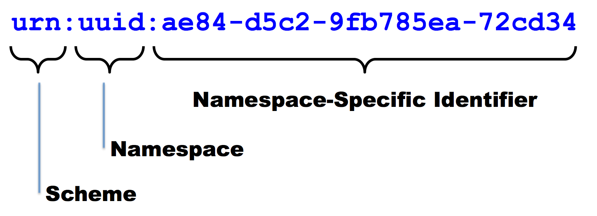
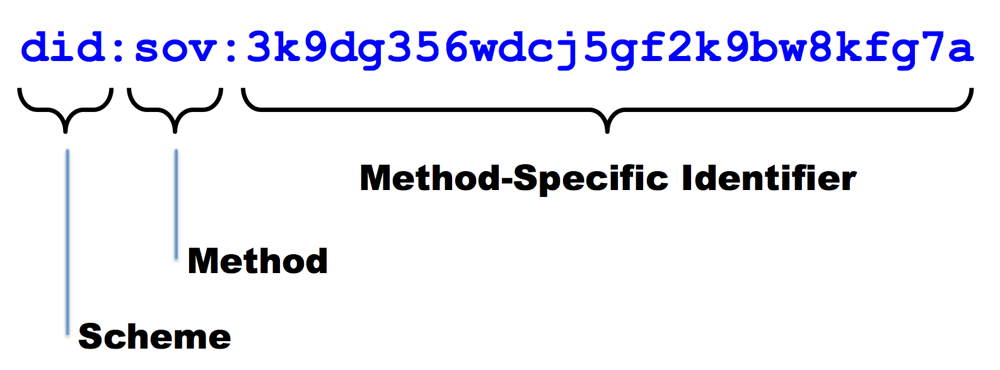
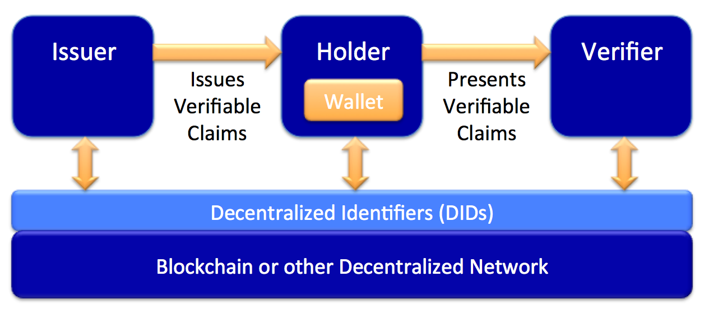

# DID Primer Spring 2018

*This is a community document maintained by co-editors Drummond Reed and
Manu Sporny and other contributors and implementers of the*
[**Decentralized Identifier 1.0
specification**](https://w3c-ccg.github.io/did-spec/)*.*

## Introduction

At a superficial level, a **decentralized identifier** (**DID**) is
simply a new type of globally unique identifier with special features
designed for blockchains. But at a deeper level, DIDs are the core component 
of an entirely new layer of decentralized digital identity and public key 
infrastructure (PKI) for the Internet. This [***decentralized public key
infrastructure***](https://github.com/WebOfTrustInfo/rebooting-the-web-of-trust/blob/master/final-documents/dpki.pdf)
(DPKI) could have as much impact on global cybersecurity and
cyberprivacy as the development of the [*SSL/TLS
protocol*](https://en.wikipedia.org/wiki/Transport_Layer_Security) for
encrypted Web traffic (now the largest PKI in the world).

This primer is designed to give newcomers to DID architecture the
background they need to understand not just the DID specification, but
the overall architecture for decentralized identity represented by the
family of DID-related specifications currently under development. It
covers:

-   Background on the origin of DIDs and the DID specification.

-   How DIDs differ from other globally-unique identifiers.

-   How the syntax of DIDs can be adapted to work with any modern blockchain.

-   How DIDs resolve to **DID documents** containing public keys and service endpoints.

-   The key role that **DID methods** play in the implementation of DID infrastructure.

-   Privacy considerations for the use of DIDs.

-   How DID infrastructure lays the foundation for **verifiable claims**.

## Setting the Stage: The Origin of DIDs

In the history of the Internet, every identifier that is both globally
unique and globally resolvable -- meaning you can look it up and obtain
metadata about the resource it identifies -- has required some type of
centralized administration. For example, both IP (Internet Protocol)
addresses and DNS (Domain Name System) names -- the foundations for the
Internet and the Web -- require centralized registries and registrars.

Although these centralized systems are very efficient, this architecture
has long been recognized as both a single point of control (and thus
potential censorship) and a single point of failure. So, in the last few
years, several groups began independently investigating decentralized
alternatives. In chronological order:

1.  The [*W3C Web Payments Working Group*](https://www.w3.org/Payments/WG/) and [*W3C Verifiable Claims Task Force*](https://w3c.github.io/vctf/), led by Manu Sporny and David Longley of Digital Bazaar, recognized that truly portable digital credentials for individuals would require a new type of identifier that was not dependent on a third-party for registration or resolution.

2.  The XDI.org Registry Working Group, led by [*OASIS XDI Technical Committee*](https://www.oasis-open.org/committees/xdi/) co-chairs Drummond Reed and Markus Sabadello and Internet Identity Workshop (IIW) co-founder Phil Windley, began looking for a decentralized solution for identifying participants in a global peer-to-peer XDI semantic data interchange network.

3.  The [*Rebooting the Web of Trust*](http://www.weboftrust.info/) (RWOT) community, led by Christopher Allen, began exploring how blockchain technology could be used to enable the decentralized digital identity and trust network originally envisioned by [*Phil Zimmermann*](https://en.wikipedia.org/wiki/Phil_Zimmermann) for [*PGP*](https://en.wikipedia.org/wiki/Pretty_Good_Privacy).

4.  [*The U.S. Department of Homeland Security (DHS) Science & Technology Directorate*](https://www.dhs.gov/science-and-technology) (S&T), led by Identity and Data Privacy Program Manager Anil John, began researching [*how blockchain technology could be used for privacy-respecting decentralized identity management*](https://www.sbir.gov/sbirsearch/detail/867797).

In the spring of 2016, all four groups converged on the concept of DIDs,
a term originally coined by the W3C Verifiable Claims Task Force. Thanks
in part to R&D funding provided by DHS S&T, work on the first
[*Decentralized Identifier 1.0
specification*](https://w3c-ccg.github.io/did-spec/) began in earnest at
RWOT \#2 in May 2016. The draft spec underwent review at RWOT \#3 and
IIW \#23 in October 2016, and was published as Implementer’s Draft 01 on
21 November 2016.

After the [*W3C Verifiable Claims Working
Group*](https://www.w3.org/2017/vc/charter.html) was approved in March
2017, in July 2017 the DID specification was contributed to the W3C
Credentials Community Group. Work on several related specifications (see
below) is continuing at RWOT and IIW events held every six months, as
well as other industry events and conferences. See Appendix A for a list
of resources and ways to become involved in the DID family of
specifications.

## How DIDs Differ from Other Globally Unique Identifiers

The need for globally unique identifiers that do not require a
centralized registration authority is not new.
[*UUIDs*](https://en.wikipedia.org/wiki/Universally_unique_identifier)
(Universally Unique Identifiers, also called GUIDs, Globally Unique
Identifiers) were developed for this purpose in the 1980s and
standardized first by the Open Software Foundation and then by [*IETF
RFC 4122*](https://tools.ietf.org/html/rfc4122).

The need for persistent identifiers (identifiers that can be assigned
once to an entity and never need to change) is also not new. This class
of identifiers was standardized as
[*URNs*](https://en.wikipedia.org/wiki/Uniform_Resource_Name) (Uniform
Resource Names) first by IETF [*RFC
2141*](https://www.ietf.org/rfc/rfc2141.txt) and more recently by [*RFC
8141*](https://tools.ietf.org/html/rfc8141).

As a rule, however, UUIDs are not globally resolvable and URNs -- if
resolvable -- require a centralized registration authority. In addition,
neither UUIDs or URNs inherently address a third characteristic -- the
ability to **cryptographically verify ownership of the identifier**.

For blockchain identity -- and more specifically **self-sovereign
identity**, which can be defined as a lifetime portable digital identity
that does not depend on any centralized authority -- we need a new class 
of identifier that fulfills all four requirements: persistence, global 
resolvability, cryptographic verifiability, and decentralization.

## The Format of a DID

In 2016 the developers of the DID specification agreed with a suggestion
from Christopher Allen that DIDs could be adapted to work with multiple
blockchains by following the same basic pattern as the URN
specification:

The key difference is that with DIDs the namespace component identifies
a **DID method**, and a **DID method specification** specifies the
format of the method-specific identifier.

DID methods (further explained below) define how DIDs work with a specific 
blockchain. All DID method specs must define the format
and generation of the method-specific identifier. Note that the method
specific identifier string **must** be unique in the namespace of that
DID method. For example the DID above uses the Sovrin DID method in
which the method-specific identifier is generated by base-56-encoding
the first half of an Ed25519 verification key.

## DID Documents

DID infrastructure can be thought of as a global [*key-value
database*](https://en.wikipedia.org/wiki/Key-value_database) in which
the database is all DID-compatible blockchains, distributed ledgers, or
decentralized networks. In this virtual database, the key is a DID, and
the value is a **DID document**. The purpose of the DID document is to
describe the public keys, authentication protocols, and service endpoints 
necessary to bootstrap cryptographically-verifiable interactions with 
the identified entity.

A DID document is a valid [*JSON-LD
object*](https://json-ld.org/spec/latest/json-ld/) that uses the **DID
context** (the RDF vocabulary of property names) defined in the DID
specification. This includes six components (all optional):

1.  **The DID itself**, so the DID document is fully self-describing.

2.  **A set of public keys or other proofs** that can be used for authentication or interaction with DID subject.

3.  **A set of authentication protocols** for authenticating the DID subject.

4.  **A set of service endpoints** that describe where and how to interact with the DID subject.

5.  **Timestamps** for auditing.

6.  **A optional JSON-LD signature** if needed to verify the integrity of the DID document.

See the [*DID specification*](https://w3c-ccg.github.io/did-spec/) for
several examples of DID documents.

## DID Methods

DIDs and DID documents can be adapted to any modern blockchain, 
distributed ledger, or other decentralized network capable of 
resolving a unique key into a unique value. It does not matter 
whether the blockchain is public, private, permissionless, or permissioned.

Defining how a DID and DID document are created, resolved,
and managed on a specific blockchain or "target system" is the role of a
**DID method specification**. DID method specifications are to the
generic DID specification as URN namespace specifications (UUID, ISBN,
OID, LSID, etc.) are to the generic IETF URN specification ([*RFC
8141*](https://tools.ietf.org/html/rfc8141)).

A DID method specification must define the following:

1.  The DID method name.

2.  The ABNF structure of the method-specific identifier.

3.  How the method-specific identifier is generated or derived.

4.  How the [*CRUD operations*](https://en.wikipedia.org/wiki/Create,_read,_update_and_delete) are performed on a DID and DID document:

    a.  **Creating** a new DID.

    b.  **Reading** (resolving) a DID document.

    c.  **Updating** a DID document.

    d.  **Deleting** (revoking) a DID.

It is these CRUD operations that may vary the most across different DID
methods. For example:

1.  **Create.** Some DID methods may generate a DID directly from a cryptographic key pair. Others may use the address of a transaction or a smart contract on the blockchain itself.

2.  **Read.** Some DID methods use blockchains that can store DID documents directly on the blockchain. Others may instruct DID resolvers to construct them dynamically based on attributes of a blockchain record. Still others may store a pointer on the blockchain to a DID document stored in one or more parts on other decentralized storage networks such as [*IPFS*](https://en.wikipedia.org/wiki/InterPlanetary_File_System) or [*STORJ*](https://en.wikipedia.org/wiki/STORJ).

3.  **Update.** The update operation is the most critical from a security standpoint because control of a DID document represents control of the public keys or proofs necessary to authenticate an entity (and therefore for an attacker to impersonate the entity). Since verification of DID document update permissions can only be enforced by the target blockchain, the DID method specification must define precisely how authentication and authorization are performed for any update operation.

4.  **Delete.** DID entries on a blockchain are by definition immutable, so they can never be “deleted” in the conventional database sense. However they can be **revoked** in the cryptographic sense. A DID method specification must define how this termination is performed, e.g., by writing a null DID document.

## Related Specifications

DIDs are the atomic unit of a new layer of decentralized identity
infrastructure. This is a list of the other specifications in the DID
family that are currently under development.

### DKMS (Decentralized Key Management System)

DIDs are only possible with public/private key cryptography; the ability
to generate, write, and update a DID and DID document to a blockchain
without any intermediary requires control of the associated private key.
This key management cannot itself rely on centralized authorities or it
would defeat the whole purpose. In short, *decentralized identity
requires decentralized key management*.

The purpose of the DKMS (Decentralized Key Management System) specification 
is to specify and interoperable protocol for managing the lifecycle of 
private keys and other private metadata associated with a DID in a way 
that is interoperable across different blockchains, apps, and vendors. 
This spec is being developed under [a grant from the Science & Technology 
Directorate of the U.S. Department of Homeland Security](https://www.dhs.gov/science-and-technology/news/2017/07/20/news-release-dhs-st-awards-749k-evernym-decentralized-key) 
based on the requirements and best practices set forth in [*NIST Special Publication
800-130*](http://nvlpubs.nist.gov/nistpubs/SpecialPublications/NIST.SP.800-130.pdf),
“A Framework for Designing Key Management Systems”.

### DID TLS

Today's TLS infrastructure uses [*X.509
certs*](https://en.wikipedia.org/wiki/X.509) based on traditional
hierarchical PKI, where [*certificate
authorities*](https://en.wikipedia.org/wiki/Certificate_authority) (CAs)
follow standardized best practices in order to qualify as trust roots
that will be recognized by browser vendors. DID TLS will decentralize this
process by enabling the standard X.509 cert elements required to
establish a TLS session to be generated dynamically from any DID and DID
document that conforms to the DID spec.

The DID TLS specification will enable encrypted, peer-to-peer
connections to be negotiated in real time between any two DID-identified
entities (people, organizations, things). This will radically expand the
protections of the TLS protocol and could potentially turn them into the
default for all nearly all forms of Internet communication.

### DID Names

The DID specification is intentionally limited to machine-generated
decentralized identifiers that are completely lacking in human
memorability or usability. However there are many use cases it is
desirable to be able to discover a DID using a human-friendly semantic
name. Such a naming service would look like a flat,
cryptographically-verifiable version of DNS.

The big difference, of course, is that a DID naming service needs to be
fully decentralized, i.e., not depend on centralized registries and
registrars. Registration of DID names would be made directly by identity
owners to the blockchain itself using the same cryptographic
verification as DID transactions.

The goal of the DID Names specification is to standardize how an
interoperable decentralized naming layer can operate directly on top of
the DID layer. A DID name is mapped to a DID the same way a DID is
mapped to a DID document. DID names will be an optional feature of a DID
method, so the governance and economics of a DID namespace can be
specified by the same community that defines the associated DID method.

### DID Auth

A common goal of all blockchain identity systems is the cryptographic
authentication of an identity owner. The various protocols all use some
type of cryptographic challenge/response similar to the [*SQRL
protocol*](https://en.wikipedia.org/wiki/SQRL) originally proposed by
Steve Gibson and the [*Web
Authentication*](https://en.wikipedia.org/wiki/Web_Authentication_Working_Group)
protocol currently being standardized by W3C. In these protocols, a
one-time challenge is issued by the relying party, signed by the
identity owner's private key, and then verified by the relying party
using the identity owner’s public key. Whereas SQRL and Web
Authentication use pairwise public keys that cannot be externally
verified, DIDs will enable verification of the public key against the
blockchain identified by the DID method.

The DID Auth specification will standardize this cryptographic
challenge/response authentication protocol so it can be used with any
DID that supports it. DID Auth endpoints would then become one of the
standard DID identity services than can be discovered via a DID
document.

## DIDs and Privacy by Design

Privacy is an essential component of any identity management solution;
it is especially critical for a global identity system that uses
immutable public blockchains. Thankfully DID architecture can
incorporate [*Privacy by
Design*](https://en.wikipedia.org/wiki/Privacy_by_design) at the very
lowest levels of infrastructure and thus become a powerful, new,
privacy-preserving technology if deployed using best practices such as:

1.  **Pairwise-pseudonymous DIDs.** While DIDs can be used as well-known public identifiers, they can also be used as private identifiers issued on a per-relationship basis. So rather than a person having a single DID, like a cell phone number or national ID number, she can have thousands of pairwise-unique DIDs that cannot be correlated without her consent, yet can still be managed as easily as an address book.

2.  **Off-chain private data.** Storing any type of PII on a public blockchain, even encrypted or hashed, is dangerous for two reasons: 1) the encrypted or hashed data is a global correlation point when the data is shared with multiple parties, and 2) if the encryption is eventually broken (e.g., [*quantum computing*](https://en.wikipedia.org/wiki/Quantum_computing)), the data will be forever accessible on an immutable public ledger. So the best practice is to store all private data off-chain and exchange it only over encrypted, private, peer-to-peer connections.

3.  **Selective disclosure.** The decentralized PKI (DPKI) that DIDs make possible opens the door to individuals gaining greater control over their personal data in two ways. First, it enables it to be shared using encrypted digital credentials (see below). Second, these credentials can use [*zero-knowledge proof cryptography*](https://en.wikipedia.org/wiki/Zero-knowledge_proof) for [*data minimization*](https://www.forbes.com/sites/bernardmarr/2016/03/16/why-data-minimization-is-an-important-concept-in-the-age-of-big-data/), e.g., you can disclose that you are over a certain age without disclosing your exact birthdate.

## DIDs and Verifiable Claims

DIDs are only the base layer of decentralized identity infrastructure.
The next higher layer -- where most of the value is unlocked -- is
**verifiable claims**. This is the technical term for a digitally signed
electronic credential that conforms to the interoperability standards
being developed by the [*W3C Verifiable Claims Working
Group*](https://www.w3.org/2017/vc/charter.html). For a complete introduction, please see the [*Verifiable Claims Primer*](https://github.com/WebOfTrustInfo/rebooting-the-web-of-trust-fall2017/blob/master/topics-and-advance-readings/verifiable-claims-primer.md).

The diagram below (from Manu Sporny) illustrates the three primary roles
in the verifiable claims ecosystem: **issuers** sign claims and give
them to **holders** (identity owners) who present them to **verifiers**
who verify the signatures in order to grant access to resources.

Note that in all three cases, the parties interact with the DID layer to
register DIDs as persistent identifiers for issuers or holders, and to
resolve those DIDs to obtain the public keys needed to verify the
signature of an issuer or holder. Since any issuer may provide claims to
any holder who may present them to any verifier, this results in set of
rich, interlocking trust relationships that do not need to conform to
any pre-established hierarchy -- a **web of trust**.

## Appendix A: DID Community Resources

Besides the links throughout this primer, these additional resources are
available to anyone interested in joining the DID community.

-   [*W3C Verifiable Claims Working Group mailing list*](https://www.w3.org/community/credentials/)

-   [*W3C Credentials Community Group*](https://w3c-ccg.github.io)

-   [*DID specification issues list*](https://github.com/w3c-ccg/did-spec/issues/)

-   [*Rebooting the Web of Trust event*](http://www.weboftrust.info/) (held every six months)

-   [*Internet Identity Workshop event*](http://www.internetidentityworkshop.com/) (held every six months)

