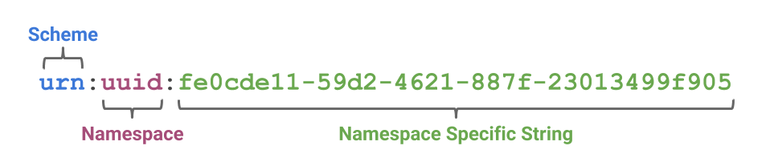
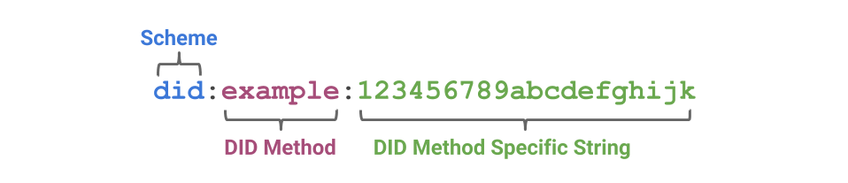

# A Short Primer for Decentralized Identifiers

*This is a community document maintained by co-editors Drummond Reed and
Manu Sporny and other contributors and implementers of the*
[**Decentralized Identifier 1.0
specification**](https://w3c-ccg.github.io/did-spec/)*.*

## Introduction

At a superficial level, a **decentralized identifier** (**DID**) is
simply a new type of globally unique identifier. But at a deeper level,
DIDs are the core component
of an entirely new layer of decentralized digital identity and public key
infrastructure (PKI) for the Internet. This [***decentralized public key
infrastructure***](https://github.com/WebOfTrustInfo/rebooting-the-web-of-trust/blob/master/final-documents/dpki.pdf)
(DPKI) could have as much impact on global cybersecurity and
cyberprivacy as the development of the [*SSL/TLS
protocol*](https://en.wikipedia.org/wiki/Transport_Layer_Security) for
encrypted Web traffic (now the largest PKI in the world).

This primer is designed to give newcomers to DID architecture the
background they need to understand not just the DID specification, but
the overall architecture for decentralized identity represented by the
family of DID-related specifications currently under development. It
covers:

-   Background on the origin of DIDs and the DID specification.

-   How DIDs differ from other globally-unique identifiers.

-   How the syntax of DIDs can be adapted to work with decentralized networks.

-   How DIDs resolve to **DID Documents** containing public keys and service endpoints.

-   The key role that **DID Methods** play in the implementation of DID infrastructure.

-   Privacy considerations for the use of DIDs.

-   How DID infrastructure lays the foundation for **verifiable credentials**.

## How DIDs Differ from Other Globally Unique Identifiers

The need for globally unique identifiers that do not require a
centralized registration authority is not new.
[*UUIDs*](https://en.wikipedia.org/wiki/Universally_unique_identifier)
(Universally Unique Identifiers, also called GUIDs, Globally Unique
Identifiers) were developed for this purpose in the 1980s and
standardized first by the Open Software Foundation and then by [*IETF
RFC 4122*](https://tools.ietf.org/html/rfc4122).

The need for persistent identifiers (identifiers that can be assigned
once to an entity and never need to change) is also not new. This class
of identifiers was standardized as
[*URNs*](https://en.wikipedia.org/wiki/Uniform_Resource_Name) (Uniform
Resource Names) first by IETF [*RFC
2141*](https://www.ietf.org/rfc/rfc2141.txt) and more recently by [*RFC
8141*](https://tools.ietf.org/html/rfc8141).

As a rule, however, UUIDs are not globally resolvable and URNs -- if
resolvable -- require a centralized registration authority. In addition,
neither UUIDs or URNs inherently address a third characteristic -- the
ability to **cryptographically verify ownership of the identifier**.

For **self-sovereign identity**, which can be defined as a lifetime
portable digital identity that does not depend on any centralized authority,
we need a new class of identifier that fulfills all four requirements:
persistence, global resolvability, cryptographic verifiability, and
decentralization.

## The Format of a DID

In 2016 the developers of the DID specification agreed with a suggestion
from Christopher Allen that DIDs could be adapted to work with multiple
blockchains by following the same basic pattern as the URN
specification:

The key difference is that with DIDs the namespace component identifies
a **DID method**, and a **DID method specification** specifies the
format of the method-specific identifier.

DID methods (further explained below) define how DIDs work with a specific
blockchain. All DID method specs must define the format
and generation of the method-specific identifier. Note that the method
specific identifier string **must** be unique in the namespace of that
DID method. For example, in the Sovrin DID method (`did:sov:`), the 
method-specific identifier is generated by base-56-encoding
the first half of an Ed25519 verification key.

## DID Documents

DID infrastructure can be thought of as a global [*key-value
database*](https://en.wikipedia.org/wiki/Key-value_database) in which
the database is all DID-compatible blockchains, distributed ledgers, or
decentralized networks. In this virtual database, the key is a DID, and
the value is a **DID document**. The purpose of the DID document is to
describe the public keys, authentication protocols, and service endpoints
necessary to bootstrap cryptographically-verifiable interactions with
the identified entity.

A DID document is a valid [*JSON-LD
object*](https://json-ld.org/spec/latest/json-ld/) that uses the **DID
context** (the RDF vocabulary of property names) defined in the DID
specification. This includes six components (all optional):

1.  **The DID itself**, so the DID document is fully self-describing.

2.  **A set of cryptographic material**, such as public keys, that can be used for authentication or interaction with the DID subject.

3.  **A set of cryptographic protocols** for interacting with the DID subject, such as authentication and capability delegation.

4.  **A set of service endpoints** that describe where and how to interact with the DID subject.

5.  **Timestamps** for auditing.

6.  **A optional JSON-LD signature** if needed to verify the integrity of the DID document.

See the [*DID specification*](https://w3c-ccg.github.io/did-spec/) for
several examples of DID documents.

## DID Methods

DIDs and DID documents can be adapted to any modern blockchain,
distributed ledger, or other decentralized network capable of
resolving a unique key into a unique value. It does not matter
whether the blockchain is public, private, permissionless, or permissioned.

Defining how a DID and DID document are created, resolved,
and managed on a specific blockchain or "target system" is the role of a
**DID method specification**. DID method specifications are to the
generic DID specification as URN namespace specifications (UUID, ISBN,
OID, LSID, etc.) are to the generic IETF URN specification ([*RFC
8141*](https://tools.ietf.org/html/rfc8141)).

DID method specifications typically define at least the following operations
for a particular target system:

1.  **Create.** Some DID methods may generate a DID directly from a cryptographic key pair. Others may use the address of a transaction or a smart contract on the blockchain itself.

2.  **Read.** Some DID methods use blockchains that can store DID documents directly on the blockchain. Others may instruct DID resolvers to construct them dynamically based on attributes of a blockchain record. Still others may store a pointer on the blockchain to a DID document stored in one or more parts on other decentralized storage networks such as [*IPFS*](https://en.wikipedia.org/wiki/InterPlanetary_File_System) or [*STORJ*](https://en.wikipedia.org/wiki/STORJ).

3.  **Update.** The update operation is the most critical from a security standpoint because control of a DID document represents control of the public keys or proofs necessary to authenticate an entity (and therefore for an attacker to impersonate the entity). Since verification of DID document update permissions can only be enforced by the target blockchain, the DID method specification must define precisely how authentication and authorization are performed for any update operation.

4.  **Delete.** DID entries on a blockchain are by definition immutable, so they can never be “deleted” in the conventional database sense. However they can be **revoked** in the cryptographic sense. A DID method specification must define how this termination is performed, e.g., by writing a null DID document.

See the [DID Method Registry](https://w3c-ccg.github.io/did-method-registry/)
for a complete list of all known DID Method specifications.

## DIDs and Privacy by Design

Privacy is an essential component of any identity management solution;
it is especially critical for a global identity system that uses
immutable public blockchains. Thankfully DID architecture can
incorporate [*Privacy by
Design*](https://en.wikipedia.org/wiki/Privacy_by_design) at the very
lowest levels of infrastructure and thus become a powerful, new,
privacy-preserving technology if deployed using best practices such as:

1.  **Pairwise-pseudonymous DIDs.** While DIDs can be used as well-known public identifiers, they can also be used as private identifiers issued on a per-relationship basis. So rather than a person having a single DID, like a cell phone number or national ID number, she can have thousands of pairwise-unique DIDs that cannot be correlated without her consent, yet can still be managed as easily as an address book.

2.  **Off-chain private data.** Storing any type of PII on a public blockchain, even encrypted or hashed, is dangerous for two reasons: 1) the encrypted or hashed data is a global correlation point when the data is shared with multiple parties, and 2) if the encryption is eventually broken (e.g., [*quantum computing*](https://en.wikipedia.org/wiki/Quantum_computing)), the data will be forever accessible on an immutable public ledger. So the best practice is to store all private data off-chain and exchange it only over encrypted, private, peer-to-peer connections.

3.  **Selective disclosure.** The decentralized PKI (DPKI) that DIDs make possible opens the door to individuals gaining greater control over their personal data in two ways. First, it enables it to be shared using encrypted digital credentials (see below). Second, these credentials can use [*zero-knowledge proof cryptography*](https://en.wikipedia.org/wiki/Zero-knowledge_proof) for [*data minimization*](https://www.forbes.com/sites/bernardmarr/2016/03/16/why-data-minimization-is-an-important-concept-in-the-age-of-big-data/), e.g., you can disclose that you are over a certain age without disclosing your exact birthdate.

## DIDs and Verifiable Credentials

DIDs are only the base layer of decentralized identity infrastructure.
The next higher layer -- where most of the value is unlocked -- is
**verifiable credentials**. This is the technical term for a digitally signed
electronic credential that conforms to the interoperability standards
being developed by the [*W3C Verifiable Claims Working
Group*](https://www.w3.org/2017/vc/charter.html).

DIDs can be used to identify various entities in the Verifiable Credentials
ecosystem such as issuers, holders, subjects, and verifiers. More generally,
DIDs can be used as identifiers for people, devices, and organizations.

See the [*Verifiable Credentials Primer*](verifiable-credentials-primer.md)
for a brief introduction to the topic.

## Appendix A: DID Community Resources

Besides the links throughout this primer, these additional resources are
available to anyone interested in joining the communities that are actively
developing specifications, experiments, and pilot projects.

-   [*W3C Verifiable Claims Working Group mailing list*](https://www.w3.org/community/credentials/)

-   [*W3C Credentials Community Group*](https://w3c-ccg.github.io)

-   [*DID specification issues list*](https://github.com/w3c-ccg/did-spec/issues/)

-   [*Rebooting the Web of Trust event*](http://www.weboftrust.info/) (held every six months)

-   [*Internet Identity Workshop event*](http://www.internetidentityworkshop.com/) (held every six months)

