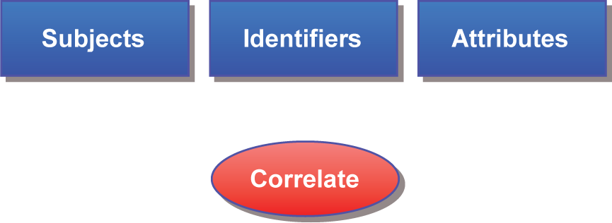
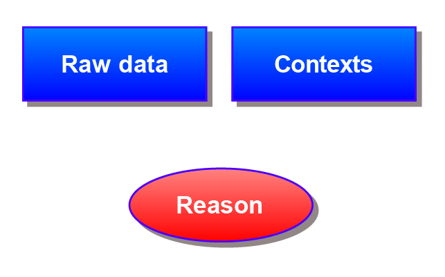
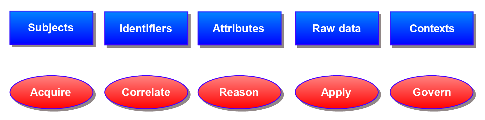
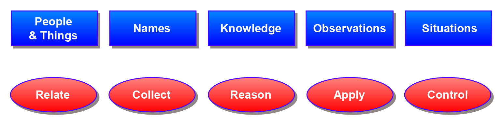

A Primer on Functional Identity
===============================

By Joe Andrieu &lt;<joe@legreq.com>&gt;

There are many ways to approach identity. For the **Rebooting the Web of
Trust** workshop \[1\], we prefer a **functional approach,** focusing
our conversation on how identity works and how it is used.

The varied facets of identity are rich. We inevitably bring our own hot
buttons and agendas to any discussion of “what identity is”. Some engage
from a philosophical perspective, others psychological. Some dive into
political or cultural issues, while others dissect the meta-physical and
spiritual. These different perspectives are valid views of identity’s
impact on our lives. More than valid. ***Vital***. They help answer the
question of “Why?” Why identity matters, why we should care.
Unfortunately, they also inflame passions and we sometimes talk past
each other to make points that seem irrelevant to others, leaving people
frustrated and unheard.

As **engineers** and **system designers**, we’re concerned with **how
things work**. We want to fix what’s broken and build things that
improve the world. To help us do that at **Rebooting the Web of Trust**,
we discuss how things function. With identity, this functional
perspective sidesteps seductive and inflammatory rabbit holes, without
dismissing them. Functional Identity lets us investigate **the HOW**
without prejudice **to WHY**, viewing identity systems based on how they
work. Then, once we understand how they function, we have a solid
foundation for discussion about how these systems affect individuals and
society.

A Functional Definition
=======================

> > Identity is how we recognize, remember, and ultimately respond to
> > specific people and things.

**That’s it**. We meet people and learn their names. We observe them and
hear gossip and potentially consume related media. We remember what we
learn. Then, we apply that knowledge to future dealings. Others do the
same with us. Even our sense of our own identity is shaped by how we
recognize, remember, and respond to our own actions and reactions.

Identity can be a wonderful thing. The joy of **a child** saying “Momma”
or **a lover** calling out your name. The pride in your name on a
diploma. The simple benefit of seeing another’s name tag at a workshop
and making a note to yourself about a fascinating conversation. Identity
enables so many benefits because it **helps us** keep track of people
and things. It helps us **recognize** friends, families, and threats; it
enables **remembering** birthdays, preferences, and histories; it gives
us the ability to **respond** to each individual as their own unique
person.

The functional approach reaches **beyond digital** systems to understand
how identity works throughout society. Our identity is bigger than our
digital selves. Our identities existed before and continue to exist
independent of any digital representation. Digital identities are simply
**tools** which help organizations and individuals manage real-world
identity.

Unfortunately, digital systems can **unwittingly compromise** real-world
identity. Sometimes this occurs because digital identity systems fail to
consider external effects. Other times, it happens with systems that
didn’t even realize they were dealing with identity information. A
functional perspective allows engineers to see **beyond** static
attributes and traditional notions of “Personally Identifiable
Information” to better understand how engineering choices can impact
identity, even outside their systems.

With a better understanding of how identity functions, we will be able
to build systems that **enhance** privacy and human dignity, while
**improving** identity assurance and security.

Identity Systems
================

An identity system is a collection of tools and techniques used to keep
track of people and things.

As individuals, we do this **naturally**, in our minds. We name things,
then use names and distinguishing features to remember what we learn. We
treat people differently based on their identity: treating our friends
and family differently from strangers and known threats.

Organizations create processes, software, and services to **achieve**
similar ends. These identity systems are best understood in terms of how
they function, which is the same as how identity has worked since the
dawn of **mankind**.

For some, identity systems are **provocative** because they help
organizations keep track of people. They trigger associations with **Big
Brother** and the **surveillance** state, inspiring dystopic visions of
embedded chips and tattooed serial numbers. Discussing a ubiquitous
“identity” layer for the Internet conjures fears of government and
corporations constantly tracking what we do, online and off.

It should. Because, in fact, these are **legitimate abuses** of identity
feared by civil libertarians and freedom-minded people everywhere. When
we talk about identity systems, we are necessarily talking about how we
keep track of people and things. Do it badly and we risk accidentally
building our own Panopticon prison \[1\]. Fortunately, by understanding
how identity functions, we can avoid, mitigate, and minimize such
abuses.

Terminology
===========

Identity is an information processing task that maps persons or things
we *might* know to what we *actually* do know. This mapping may be
entirely digital or it may rely on physical devices or sensors to
provide input from the “real” world. Functional Identity focuses on the
innate information processing that occurs in every identity system
whether it is natural or engineered, purely digital or physically
grounded.

In the domain of information processing, informational assets and
processes are the essential nouns and verbs that describe how any system
works. This next section presents a concise and *complete* set of nouns
and verbs that fully describe identity systems. When you understand
these nouns and verbs for a given system, you will understand how that
system creates, uses, and impacts identity, both within its boundaries
and in the broader context of individuals lives in society.

In the diagrams below, the blue boxes are nouns and the red ovals are
verbs. Together they comprise the building blocks for describing
identity systems.

We start with the simplest identity system, using
three nouns and a verb:

> **Subjects** are entities—people or things—under consideration.
>
> **Identifiers** are labels which refer to entities. They are used to
> keep track of what we know about those entities.
>
> **Attributes** are what we know about people and things. They describe
> the state, appearance, or other qualities of an entity.
>
> **Correlate** means to associate attributes with particular entities,
> to associate what we know about someone with either an identifier in
> the system or a subject in question.

Identity systems **correlate** **subjects** with **attributes** in two
ways. First, attributes are associated with **identifiers** referring to
specific subjects, thus building a body of knowledge. Then, when we
recognize a subject, we associate them with one or more identifiers, and
in doing so, associate them with everything associated with those
identifiers.

In digital systems, this set of related attributes is sometimes referred
as a digital identity or profile.

Input and Effect
================

We learn or acquire identity information over time, then apply what
we’ve learned to various interactions, usually elsewhere.

Acquire** means to gather identity information for use by the system.

**Apply** means to use identity information to affect change outside the
identity system, typically to moderate an interaction of the subject
with a related system.

Identity information might be **acquired** by observation or by
importing from elsewhere. We may learn about someone by watching them,
or we may learn through references, rumors, and reputation. Identity
systems acquire new information throughout their operational life, just
as we continue to learn about people throughout our lives.

Once acquired, identity information must be **applied** in a specific
situation to have impact. If we know something about someone and that
information never influences our behavior and is never shared, it
doesn’t affect the world. The way that identity information is applied
tells us how an identity system affects our lives.

For example, a website might apply the email associated with my account
to allow me to reset my password or it may send me unwanted
advertisements. The U.S. Transportation Security Administration (TSA)
applies the information on its no-fly list to prevent those identified
as potential threats from flying.

Making New Ideas
================

We gain new insights by considering both existing identity information
and previously unrelated observations. Identity is more than just what
we know about people and apply to our interactions. It’s also how we
make judgments based on what we know, gaining insights into character,
capabilities, and proclivities.

> Raw data** are data which may or may not contain information relatable
> to a person or thing.
>
> **Context** tells you why you can rely on any given identity
> information and what you may do with it.
>
> **Reason** means to evaluate existing identity information to generate
> new derived attributes.

New **attributes** are created by **reasoning** using **raw data** and
known attributes. By applying reasoning to existing observations and
related knowledge, we can gain insights that neither the subject nor the
original author anticipated. Raw data such as search history, web
browsing, and the time & location information captured by our phones,
may contain identity-related information, even when that was neither the
purpose nor the intention at the time of capture.\
\
The **contexts** associated with identity information inform us about
appropriate use, including the evidence needed to understand how
trustworthy it is. Context answers questions such as:

-   Where did it come from?

-   How did we get it?

-   When was it created or modified? By Whom?

-   What purposes, privileges, and responsibilities are attached?

In short, context allows you to evaluate if a given piece of information
is credible.

In many real-world identity systems, like that enabled by state-issued
driver’s licenses, the context is implicit, spatial, and temporal.
Online identity systems lack this physical immediacy and need to use
other mechanisms to capture and understand context.

We also reason using known attributes to derive new ones. For example,
we calculate a person’s age based on the birthdate on their driver’s
license to determine if they are old enough to drink legally. Credit
companies evaluate recent income, past transactions, and projections of
future income to set interest rates and make loan approvals. We remember
how people treat us and alter our behavior in future interactions. If
someone repeatedly breaks their word, we may stop depending on them.

Governing Identity Information
==============================

We go to great lengths to manage identity information.

**Govern** means to manage the creation and
> flow of identity information so the right people have access for the
> right reasons at the right time.

Sometimes we keep secrets to prevent information from reaching certain
people. We do this with tools like encryption, access control, and
minimal disclosure. Legal agreements between people, businesses,
institutions, and governments specify appropriate use of certain
information while laws, regulations, and the courts allow governments
and institutions to oversee, monitor, and intervene in the capture and
use of identity information. How identity systems govern who controls
certain information defines how they preserve and respect privacy.

The right to keep private information private is often referred to as
the right of privacy. Many people feel their privacy is threatened
because so much information is shared over the Internet, in our
workplaces, and through our devices. Information we share in different
contexts (business, family, community, etc.) can leak unexpectedly and
undesirably into other contexts.

It is very difficult, as individuals, to track of all the ways we are
publicly or privately tracked. Information is shared on social media,
tracked in Internet searches, monitored when using navigation software,
and captured as we use our phones. The sheer magnitude and complexity of
information sharing means the average person is essentially incapable of
making informed decisions to consent to appropriate use. Some people
give up, divulging personal information without regard to consequences.
Others opt-out, participating as little as possible in our digitally
connected world. Governance defines who gets to control this complexity
and how we do so.

Bridging the Gap
================

The nouns and verbs above are grounded in the world of technology and
may be unfamiliar for the average individual. More conversational
synonyms are presented in the tables below. Use the most appropriate
terms for your audience.

People, Places and Things
-------------------------

This is the point of identity: those people, places, and things we
recognize.

 | **Technologists** 
  **Laypeople**  |   **Common meaning** |
 |-------------------|-----------------|-----------------------------------------------------------------------------------|
  Subject        |     Person or Thing |  Someone or something under consideration. The focus of interaction or discussion.

Identity Information
--------------------

These are the abstract nouns of identity, the informational assets
created and used by identity systems.

  |**Technologists** |  **Laypeople** |  **Common meaning**|
 |-------------------|-----------------|-----------------------------------------------------------------------------------|
|  Identifiers    |     Names        |   Refers to entities. Used to keep track of people and things. |
|  Attributes     |     Knowledge    |   What we know about people and things. How we describe the state, appearance, or other qualities of an entity. |
|  Raw data       |     Observations  |  Data which may or may not contain correlatable information. |
|  Contexts       |     Situations    |  Information which allows us to evaluate if another piece of information is dependable. |

Identity Actions
----------------

These are the verbs of identity. These are the actions taken by identity
systems working with identity information.

 |**Technologists** |  **Laypeople** |  **Common meaning**|
 |-------------------|-----------------|-----------------------------------------------------------------------------------|
 | Acquire          |   Collect     |    Intake or generate identity information for use by the system. |
 | Correlate        |   Relate      |    Associate attributes or observations with particular entities. We associate what we know about someone with either an identifier in the system or with a subject in question. |
 | Reason           |   Reason      |    Evaluate existing identity information to generate new beliefs, expressed in attributes, captured in statements. |
 | Apply            |   Apply       |    Use identity information in a system, typically to moderate interactions with known entities. |
 | Govern           |   Control     |    Manage the creation and flow of identity information to the right people at the right time. |

For technologists: we assign **identifiers** to **subjects**. We collect
**raw data** and **correlate** **attributes** to the subjects we track,
in specific **contexts**. We **reason** over raw data and attributes, to
**derive** new **attributes**. We then **apply** this information to
current and future interactions with subjects. We **govern** identity
information to preserve privacy and give appropriate controls to the
right parties.

In more ordinary language: we give **names** to **people**. We collect
**observations** and linking those observations to people, remembering
**knowledge** about them. We **reason** over these observations and
knowledge to generate new knowledge. We then **apply** what we know when
dealing with those we recognize. We control identity information to
preserve privacy and to protect those we love.

This is the vocabulary of Functional Identity, a way to discuss and
understand identity in terms of functionality: how it works and what it
does for us. This is the language of identity for **Rebooting the Web of
Trust**.

Why?
====

Engineers, entrepreneurs, and financiers have asked “Why are we spending
so much time with a definition of identity? Why not just build something
and fix it if it is broken?” The vital, simple reason is **human
dignity**.

When we build interconnected systems without a core understanding of
identity, we risk **inadvertently** compromising human dignity. We risk
**accidentally** building systems that deny self-expression, place
individuals in harm’s way, and unintentionally oppress those most in
need of self-determination.

There are times when the needs of **security** outweigh the desire for
human dignity. Fine. It’s the job of our **political** systems—local,
national, and international—to minimize abuse and to establish
boundaries and practices that respect basic human rights.

But when engineers **unwittingly** compromise the ability of individuals
to self-express their identity, when we expose personal information in
unexpected ways, when our systems deny basic services because of a
flawed understanding of identity, that’s **avoidable tragedy**. What
might seem a minor technicality in one conversation could lead to the
loss of privacy, liberty, or even life for an individual whose identity
is **unintentionally compromised.**

That’s why it pays to understand identity, so the systems we build
intentionally enable human dignity instead of accidentally destroy it.

Summary
=======

Functional Identity focuses on **how identity works**. At the Rebooting
the Web of Trust, we ground our work in the functional notion of
identity and **avoid** the psychological, cultural, political, and
philosophical. These notions are important, but they can also
**distract** us from understanding the **technical choices** involved in
building and using identity in today’s networked world.

This functional notion of identity began with a conversation at the
**Internet Identity Workshop** \[3\] in May of 2016, followed by
conversations at **ID2020** \[4\] and the second **Rebooting the Web of
Trust** workshop that summer, resulting in the paper “Identity Crisis”
\[5\]. It continued in subsequent meetings in all three venues, and in
two articles published by the People Centered Internet \[6, 7\].

This primer represents a **current take** on that conversation, geared
to help Rebooting the Web of Trust participants **communicate** more
clearly and **collaborate** more effectively. We encourage your
**feedback** and look forward to continuing the conversation.

\[1\] <http://weboftrust.info>

\[2\] <https://en.wikipedia.org/wiki/Panopticon>

\[3\] <https://iiw.idcommons.net>

\[4\] <http://id2020summit.org/>

\[5\] <https://bitly.com/IdentityCrisisPaper>

\[6\] <https://peoplecentered.net/2017/06/11/speaking-of-identity/>

\[7\]
<https://peoplecentered.net/2017/07/26/how-identity-can-enable-a-people-centered-internet/>
