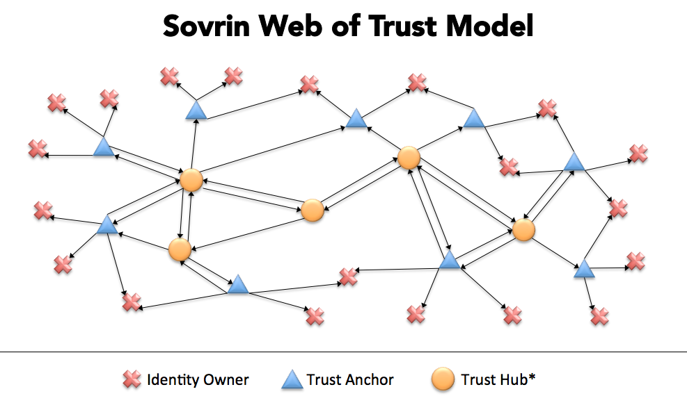
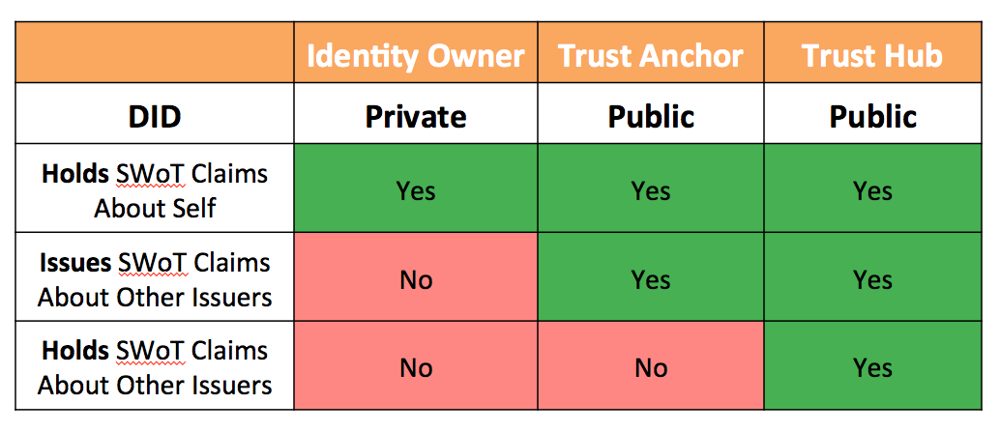

# The Three Primary Roles in the Sovrin Web of Trust Model

*Drummond Reed, Chair, [Sovrin Trust Framework Working Group](https://docs.google.com/document/d/1aJskOztz8NP8tI-9eaKaaOypF0Fm__SCLKR-U8ptSII/edit?usp=sharing).*

## Introduction

The mission of the [Sovrin Trust Framework Working Group](https://docs.google.com/document/d/1aJskOztz8NP8tI-9eaKaaOypF0Fm__SCLKR-U8ptSII/edit?usp=sharing) is to develop the foundational trust framework for Sovrin, 
a global public utility for self-sovereign identity governed by the international non-profit [Sovrin Foundation](http://www.sovrin.org/).
For a complete overview of Sovrin, see [the Sovrin white paper](https://sovrin.org/library/sovrin-protocol-and-token-white-paper).

The first version of the Sovrin Trust Framework (STF), called the [Sovrin Provisional Trust Framework](https://sovrin.org/trust-framework/),
was published in July 2017. It currently serves as the operational framework for the Sovrin Provisional Network (SPN) which launched on
31 July 2017. The SPN currently has 14 active validator nodes run by trusted organizations called [stewards](https://sovrin.org/stewards/).

The first version of the STF began the process of defining the ***Sovrin Web of Trust model*** by defining the first two roles 
in this model: ***identity owners*** and ***trust anchors***. (All Sovrin stewards are by definition trust anchors.) However the STF V1
did not define additional roles or specific mechanisms for implementing the Sovrin Web of Trust model, leaving that to the STF V2.

Based on the learnings from V1 and the progression of open standards for self-sovereign identity (SSI)—
specifically [DIDs](https://github.com/WebOfTrustInfo/rebooting-the-web-of-trust-spring2018/blob/master/topics-and-advance-readings/did-primer.md)
and [Verifiable Credentials](https://github.com/WebOfTrustInfo/rebooting-the-web-of-trust-spring2018/blob/master/topics-and-advance-readings/verifiable-credentials-primer.md)
the Sovrin Trust Framework Working Group is now developing the STF V2. This second generation will fully define the roles
and implementation mechanisms for the Sovrin Web of Trust.

This short paper will describe the three primary roles in the Sovrin Web of Trust model. Note that most of the terms used here 
are further defined in the [Sovrin Glossary](https://sovrin.org/library/glossary/). A visual depiction of how these three roles intertwine to create the Sovrin Web of Trust is shown in this diagram:

## Identity Owners

In the SSI model, there are no conventional [identity providers](https://en.wikipedia.org/wiki/Identity_provider) in the classic
sense of [federated identity systems](https://en.wikipedia.org/wiki/Federated_identity). Instead there are only identity owners who
use self-sovereign ***identity agents*** to assist them in forming relationships, exchanging verifiable credentials, and other
self-sovereign identity tasks. Identity agents interact peer-to-peer without using intermediary authorities. Note that any type of identity owner 
(person, organization, or thing) may be represented by an identity agent.

## Trust Anchors

In the Sovrin Web of Trust model, a trust anchor is an identity owner that one or more ***verifiers*** 
(also called ***relying parties***) consider to be a ***root of trust*** for one or more verifiable credentials
issued to identity owners. From a practical standpoint, this means the verifiers will trust verifiable credentials 
issued by that trust anchor under some set of policies acceptable to the verifier(s) (often defined in another trust framework).
Classic examples of trust anchors would be the banks in a banking network; the credit unions in a credit union network; 
the universities in an academic network; or the states in a federated government. There can be as many different types of trust anchors as there are different types of communities who need to achieve trust online.

## Trust Hubs

In the Sovrin Web of Trust model, a trust hub is a special type of trust anchor whose role is *to serve as a root of trust
for other trust anchors*. From the standpoint of the verifiable credentials model, a trust hub may be:

1. An ***issuer*** of verifiable credentials about other trust anchors or trust hubs.

2. A ***holder*** of verifiable credentials about other trust anchors or trust hubs.

In the former case, the trust hub is trusted to actually issue a verifiable credential that another identity owner has
trust anchor status (or trust hub status) relative to some set of policies (such as a trust framework). For example, a national banking authority, such as the Federal Reserve Bank in the United States, could serve as a trust hub for U.S. banks and directly issue 
verifiable credentials to each bank that they can use to prove they are trust anchors in a U.S. banking trust framework.

In the latter case, the trust hub is not actually required to issue credentials about other trust anchors directly, but rather 
can serve as an aggregator of verifiable credentials *issued by other trust anchors about other trust anchors*. In this function, a trust hub will typically offer directory or search services to make such credentials easily findable by members of a network or ecosystem.

An excellent example is [TheOrgBook](https://bcgov.github.io/TheOrgBook/), a trust hub developed by the identity team at the
Province of British Columbia (BC). TheOrgBook will aggregate verifiable credentials about all the businesses in BC from all of the governmental agencies operating in BC that issue registrations, permits, licenses, or any other type of official documents to businesses. See [this Rebooting the Web of Trust paper from TheOrgBook team](https://github.com/WebOfTrustInfo/rebooting-the-web-of-trust-spring2018/blob/master/topics-and-advance-readings/TheOrgBook%20-%20RWoT%20Mar%202018%20-%20Province%20of%20BC.md)
for more details.

## Comparison of the Three Roles

From the standpoint of verifiable credentials, the following diagram shows how these three roles compare regarding: a) DID visibility, and b) issuer and/or holder status.

The Sovrin Trust Framework Working Group is currently developing the standardized verifiable credentials that will be used by trust anchors and trust hubs to identify and certify each other under the STF V2.

## For More Information

The Sovrin Foundation is an international non-profit foundation dedicated to governance of the Sovrin network as a global public utility. Working groups are open to anyone. To join the STF Working Group, [see this post on the Sovrin Forum](https://sovrin.discoursehosting.net/t/joining-the-sovrin-trust-framework-working-group/502?u=drummond).

