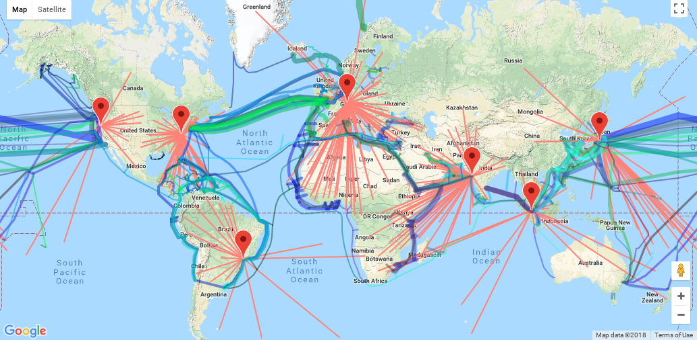
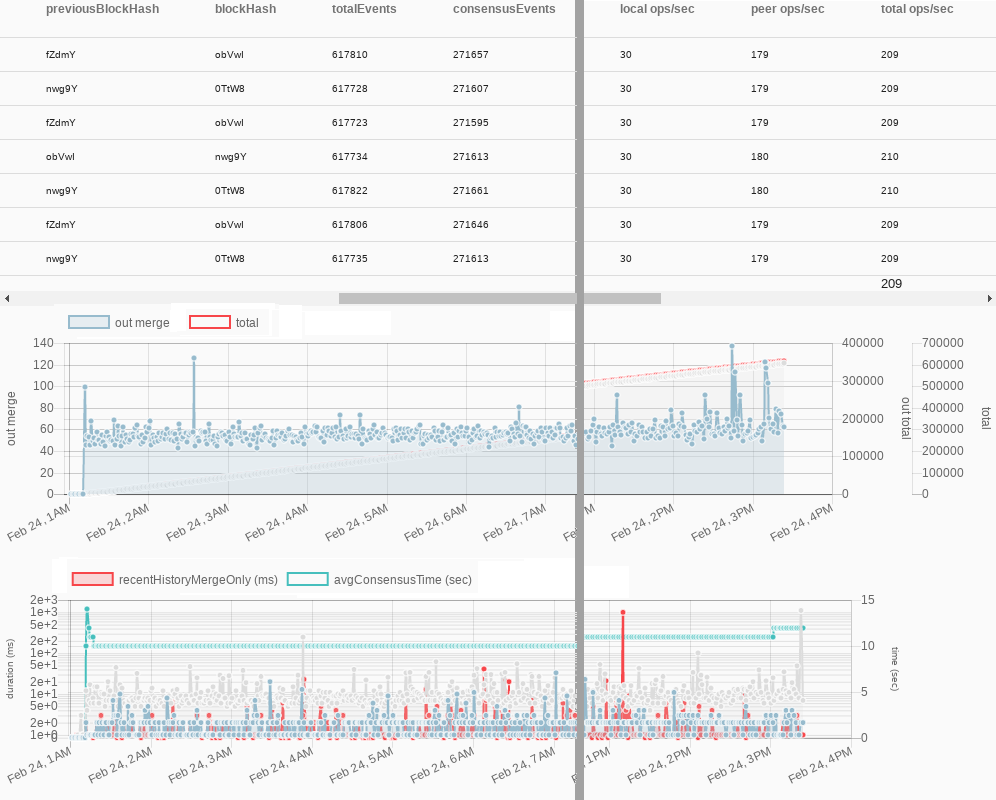

# The Veres One DID Method

Contributors: Manu Sporny, David Longley, and Chris Webber

## Abstract

The [Veres One Blockchain](https://veres.one/) is a public,
permissionless ledger designed specifically for the creation and management
of [Decentralized Identifiers](https://w3c-ccg.github.io/did-spec/).
Veres One DIDs are self-administered identifiers that may be used by
people, organizations, and digital devices to establish an identifier
that is under their control. Veres One DIDs are useful in ecosystems
where one needs to issue, store, and use Verifiable Credentials.

The [Veres One DID Method Specification](https://w3c-ccg.github.io/didm-veres-one/)
details how developers may create, update, and verify Veres One DIDs.

## Introduction

The Veres One Blockchain is a fit-for-purpose blockchain built
specifically for Decentralized Identifiers. This specialization enables
the blockchain to be faster, more cost effective, and more privacy
enhancing compared to existing blockchains that are being repurposed for
identity management. The Veres One Ecosystem is:

* **Public** - Anyone in the world may read and audit the entire contents
of the ledger.

* **Permissionless** - Any person or organization in the world may create
and control their identifiers.

* **Leaderless** - Blockchain consensus relies on leaderless elector
collaboration, not proof of work, to determine when consensus has been
finalized. Electors are selected dynamically to allow participants to join
and leave the network and to ensure that there is no centralization or
single point of failure for the ledger.

* **Based entirely on open standards and open specifications **- Broad
implementation and interoperability can only be achieved if all aspects of
the system are documented and standardized in a non-discriminatory,
patent-free and royalty-free manner while ensuring that the creators and
maintainers of the system are properly funded.

* **Built on a stakeholder driven governance model** - The source code and
development team have a strict mission-driven focus that always puts the
users of the ledger first.

* **Economically sustainable** - The people that create, run, and protect
the network are paid by the Veres One Project to do so. Avoiding a
"tragedy of the commons" is essential for sound network economics for a
global public utility.

* **Non-speculative** - Unlike other ledgers, the Veres One Blockchain
has no plans of doing an Initial Coin Offering or a Token Sale.
It does not need a speculative network token or cryptocurrency, which
eliminates currency speculation, thus ensuring predictable long term
operational costs. This approach also frees the network from hundreds of
millions of dollars in debt created during an ICO and the rampant speculation
that follows.

##  The Test Network

The Veres One Test Network is in Release Candidate 1 status and is ready for
use in Proof of Concepts and Pilot programs.

The network will transition into production after the DID Specification is
stabilized at the Rebooting the Web of Trust Spring 2018 event. A map of
Veres One Testnet data centers and their connectivity is shown below:



Each red place marker is a data center with a 99.999% uptime Service Level
Agreement. Red, blue, and green lines represent connectivity to neighboring
countries and states. Average global latency to the closest Veres One
data center is less than 50ms.

##  Performance

The Veres One Blockchain uses a leaderless, non-blocking, byzantine fault
tolerant consensus algorithm called Continuity. The algorithm reaches
consensus with probability 1. There are 3f+1 nodes in
the system where f is the number of byzantine failures the network can
tolerate. Since the algorithm
is non-blocking and nodes can progress at their own pace, the limiting factor
is how quickly events can be gossiped around the network. This approach
results in very high throughputs. Transactions are limited by two factors:
1) the fastest 2/3rds of elector's database write speeds and 2) the time
it takes to distribute at least 12f + 6 merge events to every elector in the
network, the rate of which is an exponential function.

**Warning: Benchmarks are not reflective of real world performance**

Benchmarking is a poor substitute for measurements taken over long periods
of time in hostile environments such as the public Internet. Attacks, routing
inefficiencies, packet drops, misconfigured software, and annoying physical
limitations such as the speed of light all contribute to degraded
performance in real world settings. This section should be taken with a
large grain of salt until we have dependable real world data.

**Warning: Benchmarks are highly dependent on node configuration**

The configuration for the benchmarks used 1 database with 7 electors
configured. The database was an AWS AWS i3.large instance consisting of
2 vCPUs, 15.25GB RAM and Local NVME Storage. Each node was an AWS c5.large
instance with 2 vCPUs and 4GB RAM.

Based on the goals stated in the previous section, benchmarking has been
performed on the reference Veres One implementation that is able to achieve
the following performance characteristics.

<table class="simple">
<thead>
  <tr>
  <th>Metric</th>
  <th>Capability</th>
  <th>Description</th>
  </tr>
</thead>

<tbody>
  <tr>
  <td>
Throughput
  </td>
  <td>
209/sec, 18M/day, 6.6B/year
  </td>
  <td>
The throughput is a function of how quickly 12f+1 events can be transmitted to
each elector. Limiting factors include database write speed,
communication speed, and digital signature verification speed.
  </td>
</tr>

<tr>
  <td>
Consensus Latency
    </td>
    <td>
~15-30 seconds
    </td>
    <td>
The latency is a function of how many electors there are in the system. How
many electors there are in the system is a function of the risk tolerance of
the network.
      </td>
    </tr>
  </tbody>
</table>

The image below shows a testnet operating at a constant rate of 209 operations
per second for a 14 hour period. A total of 617,810 events were processed
containing roughly 10.5M operations (e.g. DID Documents). Network consensus
times averaged around 12 seconds.



## The DID Client

A command line [did-client](https://github.com/digitalbazaar/did-client)
exists that enables one to easily create and update DIDs. An example of
the client being used to create a Veres One Decentralized Identifier is
shown below:

```
$ ./did create
Executing "create" using ledger "veres"...
Creating new DID on Veres One [test]...
  Generating RSA keypair... (5-15 seconds)
  DID: did:v1:test:nym:AiTSXFbpRt2UbaXSB9YEmc7xtk5f5GdHi2hNNMF3qy4Z
  Storing DID Document on disk...
  DID Document stored in: /home/$USERNAME/...
  Preparing to register DID Document on Veres One...
  Attaching LD-OCAP invocation proof... (~1 second)
  Generating Equihash proof of work... (60-120 seconds)
  Registering DID Document on Veres One...
DID registration successful!
```

To retrieve the DID Document from any node on the network, run this command:


```
$ ./did get did:v1:test:nym:AiTSXFbpRt2UbaXSB9YEmc7xtk5f5GdHi2hNNMF3qy4Z
Executing "get" using ledger "veres"...
Retrieving DID Document from Veres One [test]...
{
  "@context": "https://w3id.org/veres-one/v1",
  "id": "did:v1:test:nym:AiTSXFbpRt2UbaXSB9YEmc7xtk5f5GdHi2hNNMF3qy4Z",
  ... rest of DID Document will be displayed here ...
```

It may take up to 15 seconds for the network to come to consensus, so the
retrieval may fail if you try to do it too soon. If it fails, just try again.
Once you get a document back, the network guarantees that all nodes on the
network will eventually have the document if they do not already have it.

## Diving Deeper

The specifics on developing software like the DID Client shown above,
including the ability to create, update, and retrieve DID Documents on the
Veres One Ledger is detailed in the
[Veres One DID Method Specification](https://w3c-ccg.github.io/didm-veres-one/).

## Acknowledgements

Thanks to Anil John for his guidance and funding from the United States
Department of Homeland Security's Science and Technology Directorate under
contract HSHQDC-17-C-00019. The content of this document does not necessarily
reflect the position or the policy of the U.S. Government and no official
endorsement should be inferred.

Thanks also to the Rebooting the Web of Trust group facilitated by
Christopher Allen, Shannon Appelcline, Kiara Robles, Kaliya Young,
Brian Weller, Betty Dhamers, and Joe Andrieu. The Internet Identity
Workshop community, co-founded by Phil Windley, Kaliya Young, and
Doc Searls, also helped shape much of what we've implemented in Veres One.
We are also indebted to all of the good people in the W3C Verifiable
Credentials WG as well as the W3C Credentials Community Group. The
difficult and length debates in each of these comunities has only helped
to strengthen Veres One.
